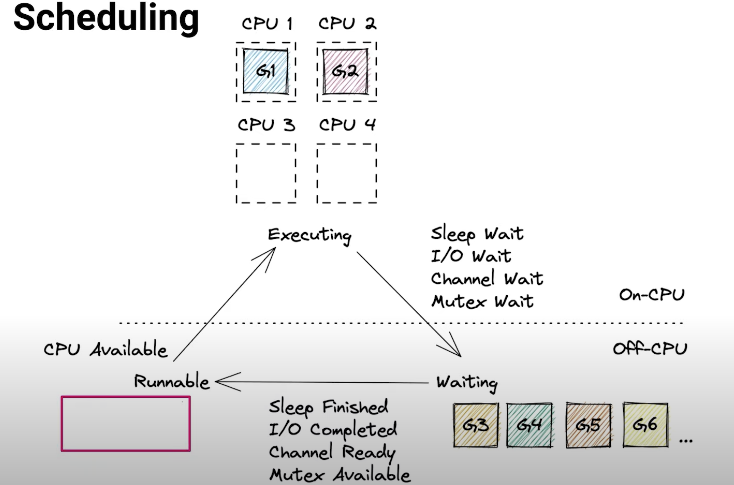
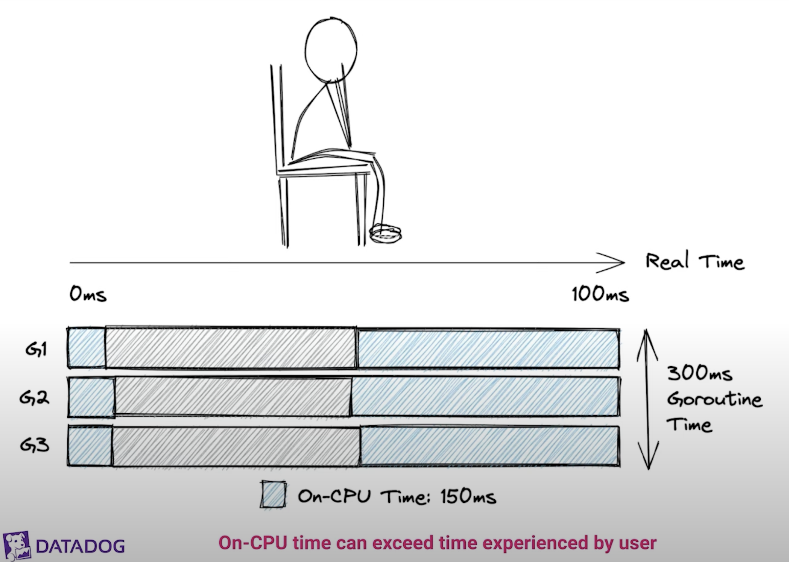
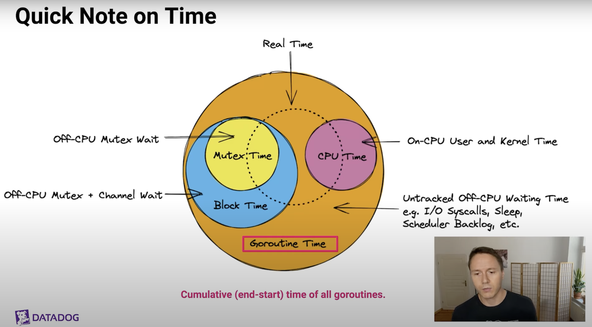

# [NOTE] Go Profiling and Observability from Scratch

## Agenda

- Scheduling & Memory Management: A simple model
- Profiling: CPU, Memory, Mutex, Block, Goroutine + Overhead Benchmarks
- Tracing: Manually, Distributed, Runtime
- Metrics: Runtime Metrics
- 3rd party Tools: Linux perf, BPF, Delve,fgprof

 ## Scheduling & Memory Management

- Go's primary job is to multiplex and abstract hardware resources
- Very similar to an operating system, - it's turtles all the way down
- Following model recap for some, but perhaps more useful than more complex models usually presented.

### Scheduling

- Go schedules goroutines onto CPUs (OS Threads)
- Deeply integrated with networking, channels and mutexes
- Scalable to hundred of thousands of goroutines



### Memory Management

- Small stack per goroutine (4kB+)
- Big heap, needed for shared data and other reasons
- Stack allocation is very cheap 
- Heap allocation and GC is expensive (20%+ CPU Time common)
- Reduce: Turn heap into stack allocs or avoid completely
- Reuse: Reuse heap allocations like structs and buffers
- Recycle: Some GC work is inevitable, it's okay
- Reducing heap allocs speed up unrelated code (GC thrashes CPU Caches)

### Memory Management: Heap

- Referenced Allocation (In-Use)
- Unreferenced Allocation (Garbage)

## Profiling

### CPU Profiler

- Captures: On-CPU time of your code by interrupting the process after every 10ms of CPU Time to take a stack trace.
- Profile Data: Sample count and time spent per stack trace
- Sample Rate: runtime.SetCPUProfileRate(hz)

### CPU Profiler: SIGPROF for every 10ms of CPU Time

```go
// go 1.17.3 src/runtime/signal_unix.go
func setProcessCPUPROFILER(hz int32) {
  if hz != 0 {
    // Enable the Go signal handler if not enabled.
    if atomic.Cas(&handlingSig[_SIGPROF], 0, 1) {
      atomic.Storeuintptr(&fwdSig[_SIGPROF], getsig(_SIGPROF))
      setsig(_SIGPROF, funcPC(sighandler))
    }
    
    var it itimerval
    it.it_interval.tv_sec = 0
    it.it_interval.set_usec(1000000 / hz)
    it.it_value = it.it_interval
    setitimer(_ITIMER_PROF, &it, nil)
  } else {...}
}

func sighandler(sig uint32, info *siginfo, ctxt unsafe.Pointer, gp *g) {
  _g_ := getg()
  c := &sigctxt{info, ctxt}
  if sig == _SIGPROF {
    sigprof(c.sigpc(), c.sigsp(), c.siglr(), gp, _g_.m)
    return
  }
  // ...
}
```

### CPU Profiler: Add Stacktrace to Profile

```go
// go 1.17.3 src/runtime/proc.go
const maxCPUProfStack = 64
func sigprof(pc, sp, lr uintptr, gp *g, mp *m) {
  // ...
  var stk [maxCPUProfStack]uintptr
  // ...
  n := gentraceback(pc, sp, lr, gp, 0, &stk[0], len(stk), ...)
  // ...
  cpuprof.add(gp, stk[:n])
}
```

### CPU Profiler: Waiting for Go 1.18

- setitimer(2) fails to deliver more than 250 signals per second, biases profile to underestimate CPU Spikes, see GH #35057
- Go 1.18 patch from Rhys Hiltner will fix this and thread bias issues such as GH #14434 by using timer_create(2)

### Block Profiler

- Captures: Off-CPU time waiting on channels and mutexes

- But not: Sleep, I/O, Syscalls, GC, etc.

- Profile Data: Cumulative contentions and delays per stack trace

  |           stack trace           | contentions/count | delay/nanoseconds |
  | :-----------------------------: | :---------------: | :---------------: |
  |   main; foo;runtime.chansend1   |       22820       |     867549417     |
  | main; foo;bar;tuntime.chanrecv1 |       22748       |     453510869     |
  | main;foobar;sync.(*Mutex).Lock  |        795        |      5351086      |

- Sample Rate: runtime.SetBlockProfileRate(rate)

### Mutex Profiler

- Captures: Off-CPU time waiting on mutexes (not channels)

- Profile data: Cumulative contentions and delays per stack trace

  |            stack trace             | contentions/count | delay/nanoseconds |
  | :--------------------------------: | :---------------: | :---------------: |
  |  main; foo; sync.(*Mutex).Unlock   |       22820       |     867549417     |
  | main; foo;bar;sync.(*Mutex).Unlock |       22748       |     453510869     |
  |  main;foobar;sync.(*Mutex).Unlock  |        795        |      5351086      |

- Rate: runtime.SetMutexProfileFraction(rate)

### Block vs Mutex

- Block seems like a superset of mutex profile, but it's not:
- **Mutex profile** shows what code is **doing the blocking**
- **Block profile** show what code is **getting blocked**
- Both perspectives are useful, so enable both profilers

### Quick Note on Time



On-CPU Time > Real Time



- Goroutine Time: Cumulative (end - start) time of all goroutines
- CPU Time: CPU tiem circle can be larger than Real time circle
- Mutex Time
- Block Time: Block time is a superset of mutex time (but with different call stacks)
- Untracked Off-CPU Waiting Time: Profiling Blindspot!

### Memory Profiling

- Profile Data: Cumulative allocs and inuse per stack trace

  | stack trace  | alloc_objects/count | alloc_space/bytes | inuse_objects/count | inuse_space/bytes |
  | ------------ | ------------------- | ----------------- | ------------------- | ----------------- |
  | main; foo    | 5                   | 120               | 2                   | 48                |
  | main;foo;bar | 3                   | 768               | 0                   | 0                 |
  | main;foobar  | 4                   | 512               | 1                   | 128               |

- Samples captured every 512kB of malloc() and when those objects are free()'d by the GC later on (inuse = allocs - frees)

- Sample Rate: runtime.memProfileRate = rate (default = 512kB)

```go
func main() {
  user := &User{Name: "alice"}
  fmt.Printf("User: %v\n", user)
}
```

```assembly
LEAQ type."".User(SB), AX
PCDATA $1, $0
NOP
CALL runtime.newobject(SB)
MOVQ $5, 8(AX)
LEAQ go.string."alice"(SB), CX
MOVQ CX, (AX)
```

### Goroutine Profiling

- Profile Data: Goroutine count per stack trace

  | stack trace   | goroutine/count |
  | ------------- | --------------- |
  | main;foo      | 5               |
  | main; foo;bar | 3               |
  | main;foobar   | 4               |

- O(N) **Stop-The-World** where N is the total number of goroutines (cause tail latency)

- **No Sampling Mechanism**

- **Use Cases**: Detect goroutine leaks and diagnose hanging programs(debug=2)

## Tracing

- **Tracing**: Recording of time-stamped events

  Distinction with logging can be muddy, depends on context

- **Distributed Tracing**: Tracing requests through multiple services

  Highly recommended to understand performance from system perspective

- **Runtime Tracing**: Go's built-in tracer

  Can shine a light on profiling blindspots (e.g. I/O, Sleep, GC, Scheduler Backlog)

- **Tracing Profiler**: Tracing every function call

  Doesn't currently exist for Go

### Runtime Tracer

- Traces Scheduler, GC, Contentions, Syscall, etc.

  see src/runtime/trace.go for a list of events

- High-overhead firehose that produces a lot of data

- But fantastic way to track down latency when nothing else seems to have the answer

### Profiling and Tracing Overhead Analysis

- Run different workloads in a loop for 1 minute with and without various profilers enabled, measure avg latency
- Repeat each experiment 5 times
- Performed on a AWS c5.4xlarge machine(6h total duration)
- This is hard! Early sneak peek, bad env, bad stats, naive workloads, do not trst too much!

### Overhead Analysis: Error Sources

- Dynamic frequency scaling (Turbo Boost)
- Noisy Nerghbors
- Human error
- Check for new results by the time you watch this
- But: Very low overhead for cpu, memory, mutex and block profiler for non-pathological workloads

## Metrics

- Use runtime/metrics (Go 1.16+), highlights: (*mB ~ 100mB)

  | metric                                      | description                                            |
  | ------------------------------------------- | ------------------------------------------------------ |
  | **/gc/pauses:seconds**                      | Stop-the-world pause latency histogram                 |
  | **/sched/latencies:seconds**                | Goroutines waiting in runnable state latency histogram |
  | /sched/goroutines:goroutines                | Number of live goroutines                              |
  | /memory/classes/heap/objects:bytes          | Current heap memory usage                              |
  | /memory/classes/heap/stacksbytes            | Current stack memory usage                             |
  | **/memory/classes/profiling/buckets:bytes** | Memory used by internal profiling hash maps            |

- Recommendation: Capture all runtime/metrics

## 3rd Party Tools

- Linux Perf
- bpftrace
- delve
- fgprof

## Scheduling / Execution Observability

- Profilers: CPU, Block, Mutex, Goroutine
- Tracing: Runtime Execution Tracer, Distributed Tracing
- Metrics: Scheduler Latency, Goroutine Count
- Compile Time: Function Inlining (go build -gcflags='-m')

## Memory Management Observability

- Profilers: Memory Profiler
- Tracing: Runtime Tracing (GC Events)
- Metrics: GC counters, GC pause times, Heap Stats, Stack Stats
- Compile Time: Escape Analysis (go build -gcflags='-m')

## Recap

- Go runtime offers great observability out of the box
- Most tools play nice with production workloads
- 3rd party tools and custom instrumentation can close the gaps

## Source

- [GopherCon 2021: Felix Geisendörfer - Go Profiling and Observability from Scratch](https://www.youtube.com/watch?v=7hg4T2Qqowk)