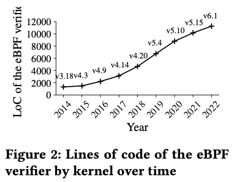
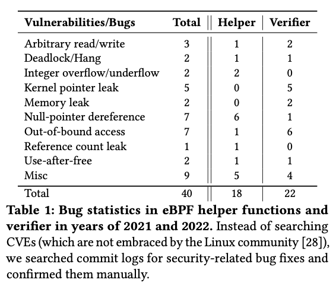
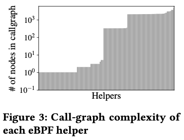
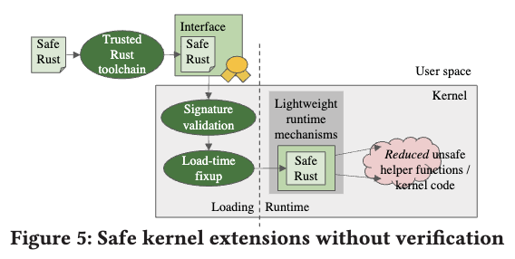

---
title: "[译]内核扩展验证是站不住脚的·HOTOS '23"
date: "2023-07-07T14:15:26+08:00"
draft: false
layout: post
description: "本文翻译自2023年HOTOS Conference中的论文--[Kernel extension verification is untenable](https://dl.acm.org/doi/10.1145/3593856.3595892)"
author: "Wenhao Jiang"
tags:
  - Kernel
  - OS
  - eBPF
  - Rust
URL: "/2023-07-07/kernel-extension-verfication"
--- 
# [译]内核扩展验证是站不住脚的·HOTOS '23

本文翻译自2023年HOTOS Conference中的论文--[Kernel extension verification is untenable](https://dl.acm.org/doi/10.1145/3593856.3595892)

译者水平有限,翻译纯属爱好.如遇到问题,烦请指出,不胜感激.

统一本文一些特定词汇翻译:

- escape hatches - 逃逸漏洞
- helper function - 辅助函数
- verification - 验证器

## 摘要

经过验证的eBPF字节码的出现迎来了一个安全内核扩展的新时代。在本文中，我们论证eBPF的验证器——其安全保证的来源,已经逐渐成为了一个累赘。除了众所周知的源于内核内验证器的复杂性和特殊性质的错误和漏洞之外，我们还强调了一个令人担忧的趋势，即引入了不安全内核函数(以辅助函数的形式)的逃逸漏洞，以绕过验证器对表达性施加的限制，不幸的是也绕过了它的安全保证。我们提出安全的内核扩展框架，不仅使用静态技术，而且使用轻量级运行时技术。我们描述了一种在安全Rust中以内核扩展为中心的设计，它将消除对内核内验证器的需求，改善表达性，允许减少逃逸漏洞，并最终提高内核扩展的安全性。

## 1 介绍

Linux中以eBPF形式出现的流行安全内核扩展框架已经点燃了一个围绕系统级功能的行业，从跟踪和可观察性[21]一直到安全性[26]、网络[23]、存储[20,52]和共识[53]。其价值主张的核心是前所未有的对于安全的承诺。为此，eBPF程序被编译成受限制的字节码，内核在此基础上执行验证:一种符号执行形式，检查所有可能的程序路径并保证属性，包括内存安全、免于崩溃、适当的资源获取和释放以及终止。

不幸的是，当前的内核内eBPF验证方法并没有达到它所承诺的安全性。在社区中，越来越多的人开始质疑内核验证器的正确性，而内核验证器的复杂性也在不断增加。由验证器引入的内核bug，以及利用不安全扩展通过验证器验证但违反安全属性的漏洞，在不断报告(见2.1节)。人们正在努力通过模糊测试[41]、验证验证器[11]或用携带证明的代码重写验证器[39]来改进eBPF验证器。

然而，即使验证器是完美的，我们观察到被验证的代码只占扩展程序的一小部分。在eBPF中，经过验证的代码与一组不断增长的潜在复杂且未经验证的辅助函数交互，这些辅助函数充当“逃逸漏洞”，以弥补因验证所需在程序表达性的严重限制(参见图1)。事实上，通过使用辅助函数，经过验证的“安全”eBPF程序可能违反上述所有验证保证。因此，尽管扩展编写者为在内核验证器的约束下编程付出了沉重的代价，但他们并没有得到承诺的安全保证。

我们的立场是，目前仅依赖静态字节码验证的安全内核扩展的短视方法是站不住脚的。相反，我们主张采用一种更广泛的方法来实现安全的内核扩展，而不是静态字节码验证。受过去[10]和现在[12,37]在操作系统内核中使用语言安全的启发，我们的**关键见解**是，通过平衡语言安全、运行时保护以及检查安全性和执行内核职责之间的关注点分离，扩展框架可以在类似的安全性下更具表现力。增强的表达性减少了对危险的辅助函数的需求，从而产生更好、更实用的保证。

我们建议使用Rust编程语言编写内核扩展，因为它的安全方法——包括但不限于内存安全、未定义行为和资源所有权——已经在其他操作系统环境中进行了探索[9,12,31,37]，并被Linux所接受[8]。我们没有尝试检查内核中的安全属性，而是允许一个受信任的用户空间Rust工具链对扩展进行签名，并利用安全密钥引导机制在加载时验证签名。最后，我们建议使用轻量级运行时机制来补充Rust，以实现诸如程序终止之类的属性，这些属性不容易在不严重影响表现力的情况下静态地完成。

我们相信，转向安全的、富有表现力的基于语言的扩展是行业持续发展的关键一步，也是围绕安全内核扩展出现更复杂用例的关键一步。此外，作为一个用安全语言实现内核功能的新入口，我们相信安全的Rust扩展将成为响应安全实用的操作系统内核号召的重要工具[31]。

## 2 验证是不被保证的

尽管eBPF验证令人兴奋和充满希望，但内核扩展并没有实现人们所期望的安全特性。因此，内核社区对eBPF持谨慎态度，甚至拒绝允许非特权用户加载(经过验证的)内核扩展的用例[22]。在这里，我们提供有关验证器已知问题的更多细节，确定由辅助函数引起的对验证器保证的新挑战，并提出远离验证器的理由。

### 2.1 验证并不容易

众所周知，目前Linux中的eBPF验证器由于其日益增加的复杂性和不断的变化，以及健全和完整的静态分析的挑战，是存在漏洞和脆弱的[19,33,39,50]。在这里，我们强调了验证器的复杂性和错误的增长，以及它的成本。

**验证器的复杂性正在增长。**如图2所示，自2014年引入eBPF验证器以来，它的规模一直在增长，以支持新的功能检查。例如，随着bpf_spin_lock helper的引入，验证器开始检查eBPF程序一次是否只持有一个锁，并在任何执行结束之前释放该锁[48]。为了支持BPF-to-BPF调用，在验证器中添加了500行C代码[45]。同时，验证器一直在不断优化和重构，以减少验证时间和内存消耗。正在积极开发的大量新的验证器特性(例如，[18,49])表明eBPF尚未达到足够的表达性。我们预计这种增长在近期内不会放缓。

**验证存在bug。**不断增加的复杂性导致不断引入新的错误。表1显示了在过去两年中，在eBPF验证器中至少发现了22个bug。这些漏洞导致了两种类型的漏洞利用。

首先，有缺陷的验证器可能会接受不安全的恶意eBPF程序，从而允许诸如任意读写[2,4,5]、内核指针泄漏[3,13 - 15,32]和特权升级[2,4]等攻击。例如，在CVE-2022-23222[4]记录的最近的一个错误中，指针值的验证缺失允许非特权用户执行非法的指针算术，导致内核内存上的任意读写能力，最终导致特权升级。其次，验证器本身可能容易受到攻击，并被不安全的恶意eBPF程序利用。例如，最近的一次提交[54]修复了验证器的循环内联代码中的use-after-free错误。

此外，即使是完美编码的验证器也无法阻止恶意eBPF程序利用eBPF生态系统下游组件(如JIT编译器)中的漏洞[38]。例如，JIT编译器中最近的一个bug[1]允许恶意eBPF代码成功通过了验证器进而劫持内核控制流。

验证是昂贵的。验证既要耗费人力时间，也要耗费机器时间。众所周知，验证器经常误报，这不必要地迫使开发人员大量修改正确的eBPF代码以通过验证器[19,39,50]。一个更基本的问题是验证器的有限可伸缩性。由于验证者需要评估所有可能的执行路径，因此必须限制eBPF程序的大小和复杂性，以便及时完成验证。为了满足这些验证器的限制，开发人员在编写大型复杂程序时需要找到将程序分解成小块的方法[20]。其结果是可编程性降低，性能开销增加[29]。

### 2.2 验证代码需要辅助函数的帮助

即使使用正确实现的验证器，安全性的承诺仍然很难实现，因为验证代码以辅助函数的形式与不安全的内核代码交互。如图1所示，辅助函数(helpers)是普通的、未经验证的内核函数，通常提供对各种内核数据结构(例如套接字缓冲区)的读/写访问。因为复杂的逻辑或程序外的内存访问可能无法在eBPF中表达，也无法由内核验证器进行验证，所以辅助函数的存在为eBPF程序提供了逃逸漏洞，使其变得更加有用。另一方面，辅助函数为验证过的代码逃逸提供了一种直接的机制。

**辅助函数很复杂。**人们普遍认为，复杂的代码往往比简单的代码有更多的bug。为了度量辅助函数的复杂性并首先指出它们的潜在危险，我们静态地分析了Linux内核版本5.18，以计算每个辅助函数的调用图。图3显示了Linux-5.18.1中249个helper函数的调用图中唯一节点的数量。如图所示，helper函数的复杂程度各不相同。例如，获取当前任务的PID和TGID的bpf_get_current_pid_tgid不调用其他内核函数。另一方面，bpf_sys_bpf允许eBPF程序调用bpf系统调用的一个子集，它的callgraph中有4845个节点。具体来说，52.2%的辅助函数调用30多个其他内核函数，34.5%调用500多个其他函数。helper函数实现中的错误和漏洞是其复杂性的自然结果，如下所述，这些错误和漏洞可能被不安全或恶意的eBPF程序利用。

**辅助函数正在增长。**引入新的辅助函数的主要动机是提高eBPF程序的表达性和实用性。随着研究人员和实践者发明安全内核扩展的新用例，而不是在eBPF中实现这些新用例并将它们传递给验证器，他们正在引入新的辅助函数。图4显示了helper数量随时间的增长情况。大约每两年添加50个辅助函数。除了这些专门为eBPF程序开发和公开的辅助函数外，开发人员还引入了新的方法来公开现有的内部内核函数，供eBPF程序使用[16]。由于这些内部内核函数在编写时并没有考虑到eBPF的使用，因此eBPF程序使用它们更有可能导致违反安全规定。在这种趋势下，在未来十年中，辅助函数接口将与系统调用接口一样宽(或比系统调用接口更宽)，为经过验证的代码提供许多触发意外行为的机会。

**辅助函数可能会违反规则。**随着更多新helper的引入，各种helper函数中的错误和漏洞也不断被发现。如表1所示，在过去两年中，已经在Linux内核中发现并修复了至少18个与安全相关的bug。

这些结果表明，辅助函数远非安全，并且很容易违反验证者假设的属性。

为了具体地展示当今辅助函数的危险，我们检查验证器保证的两个不同属性——安全性和终止。

- 安全。验证器确保eBPF代码不能访问程序外部的内存，包括试图解引用NULL指针。但是，通过一个辅助函数，我们编写了使内核崩溃的eBPF程序。具体来说，我们发现了helper bpf_sys_bpf中的一个错误，并构造了一个eBPF程序，用一个包含NULL指针字段的联合指针参数调用helper。

  由于验证器没有执行深入的参数检查，我们通过解引用联合内部的NULL指针来实现内核崩溃。我们报告了这个bug，很快就确定它是可利用的(允许任意内核读取)，并分配了一个CVE[5]。

- **终止。**eBPF验证器应该保证终止，以防止由错误或恶意eBPF程序引起的内核锁定。然而，我们可以很容易地编写一个eBPF程序，它可以在持有RCU读锁的情况下运行几乎无限的时间，从而导致RCU停滞。

  我们精心设计的eBPF代码使用对bpf_loop helper的嵌套调用来对eBPF映射对象执行随机读写。它给了我们对总运行时间的线性控制;

  虽然我们已经连续运行了800秒(足以观察到RCU的停顿)，但我们计算出，如果有更多的嵌套循环和eBPF尾部调用[44]，我们可以制作一个可以运行数百万年的程序。

### 2.3 eBPF验证器需要退休

退一步说，目前的eBPF核查方法不充分的原因有两个:

- 静态字节码验证具有可靠性和完整性问题，并且从根本上难以扩展，这不可避免地会产生不安全的代码。

- 对扩展表达性的不合理约束导致以辅助函数的形式引入不安全的逃逸漏洞。

到目前为止，社区主要通过改进验证器实现来关注第一个问题。使用抽象解释实现用户空间验证器[19]。模糊验证和形式化验证被提出来改进现有的验证器和JIT编译器[11,38,39,41,50,51]。通过携带证明的代码，人们正在探索从内核中解耦证明的负担[39]。

不幸的是，据我们所知，不安全的辅助函数的问题被忽视了;我们预计，即使在验证方面取得了上述进展，辅助函数仍将继续破坏安全性。

## 3 BEYOND VERIFICATION

与其继续沿着静态字节码验证的路径前进——这是无效的——我们对安全内核扩展的新方法提出以下建议:

- **扩展语言应该更具表现力。**更具表现力的安全语言可以消除对某些辅助函数的需求，并简化其他辅助函数。

- **静态代码分析应该与内核解耦**。利用在类型检查器和正式软件验证上工作的更广泛的(用户空间)社区，可以减少由于特殊实现而产生的错误。

- **静态分析和运行时机制应该一起工作。**实现易于在运行时执行且有效的属性可以减少分析和/或验证的负担(及其复杂性)。

在本节的其余部分中，我们将描述一种安全内核扩展的潜在体系结构，它不需要过于严格的验证，从而避免了它的缺陷。

### 3.1 一种基于Rust的方法

我们建议，安全的内核扩展不应该完全依赖于使用执行模拟的内核内静态字节码验证，而应该依赖于语言安全和轻量级运行时机制的组合。图5给出了提议的内核扩展框架的概述。

**Rust的安全属性。**由于其轻量级抽象、有效消除未定义行为(例如内存错误或整数错误)和独特的内存所有权模型，Rust正在成为一种流行的系统编程语言，甚至适用于操作系统内核[9,12,31,37]。通过限制用户实现的扩展程序只使用安全的Rust(即，没有不安全的块)，Rust编译器扮演了验证者的角色，以确保代码可以安全运行。我们设想一个可信的“内核箱”，它提供扩展程序的安全Rust和内核之间的接口。

除了内存和整数安全之外，Rust还可以强制执行与安全资源获取和释放相关的属性。例如，在eBPF中，验证器当前检查程序通过辅助函数获得的资源的正确释放(例如，从bpf_sk_lookup_tcp helper获得的引用计数和从bpf_spin_lock helper函数获得的自旋锁)，拒绝可能会使资源悬空的程序。在Rust中，资源获取即初始化(resource-acquisition-is-initialization, RAII)模式[7]可用于创建用户扩展代码必须使用的内核资源的抽象。当对象超出作用域时，该资源将在析构函数中自动释放，从而保证其正确释放。

**解耦静态代码分析。**我们不是在加载时分析代码以确保内核内部一次性实现的安全性，而是利用完整的Rust社区、工具链和许多正在进行的Rust验证项目[40]来执行安全检查。通过捎带内核对签名内核模块(甚至签名eBPF程序[43])的支持，我们的体系结构包含一个可信任的编译器，该编译器可以检查和签名扩展程序(参见图5)。在加载时，内核检查签名以确保安全。内核可能需要在程序上执行一定数量的加载时修复，以解析辅助函数地址和其他重定位，但它不会产生检查安全属性的负担(和复杂性)。

**运行时的保护。**作为一种通用编程语言，即使是使用Rust的安全子集的程序也会表现出不良行为，包括无限循环或死锁。虽然我们依赖Rust语言进行内存隔离和防止未定义行为，但我们使用像看门狗计时器、信号和堆栈保护等运行时机制来终止程序，而不是违反安全性。相关工作还探讨了在运行时使用硬件保护，包括轻量级页面保护键来增强语言安全性[27,30,33]。

运行时机制提出的一个关键挑战是如何执行扩展程序的安全终止。任何分配的内核资源(例如，引用计数)在任何原因(看门狗超时，Rust自己的Panic)终止时释放是至关重要的。在用户空间中，Rust使用基于ABI的堆栈展开机制(例如，llvm- libwind)来处理异常并执行清理操作，但这种方法不适用于内核扩展:

- unwind过程中的失败在用户空间中是允许的，但在内核空间中是不能容忍的，因为不完整的清理意味着泄漏内核资源。

- 基于ABI的展开通常需要动态分配，这给中断上下文中的扩展带来了挑战，其中分配器可能不可用[17]。

- 展开通常对堆栈上所有现有对象执行析构函数，但执行不可信的用户定义析构函数(通过Rust中的Drop特性)是不安全的。

在我们的框架中，轻量级机制可以有效地清理内核资源。我们可以在程序执行期间实时记录分配的内核资源及其析构函数。当需要终止时，调用已分配资源的析构函数来释放资源。因为只有与内核资源接口的受信任的内核crate才负责实现上述析构函数，所以所有的清理代码都是受信任的，并保证不会失败。为了处理unwind上下文的动态分配，我们设想使用基于内存池的分配机制，或者避免动态分配，同时使用专用的每cpu存储区域。

安全属性。表2总结了通常由验证器强制执行的主要安全属性，这些属性可以由提议的内核扩展框架通过语言安全和运行时保护来强制执行。与eBPF不同，它们不受循环和程序大小的限制。我们将在第四节中讨论其他已验证的性质。

### 3.2 没有逃逸漏洞的安全

与当前eBPF编程模型中C的受限子集相比，Rust是一种高级图灵完备语言，这一事实提供了更好的可编程性优势。在本节中，我们将讨论这类辅助函数，这些辅助函数可以通过利用Rust增强的表达性来完全消除，也可以通过在安全的Rust中重写函数的某些方面来简化和提高其安全性。

首先，为弥补eBPF语言的表达性不足而引入的辅助函数可以退役。我们使用bpf_loop, bpf_strtol和bpf_strncmp作为三个代表性的例子:(1)bpf_strtol可以被Rust中内置的core::str::parse取代，(2)bpf_strncmp可以完全在安全的Rust中实现，而不需要在内核中调用不安全的C代码，(3)bpf_loop可以直接删除，因为它只是提供了一个循环机制。根据初步研究[33]，有16个辅助函数属于这一类，可能会被淘汰。

其次，许多与内核对象和过程接口的辅助函数不能完全删除，但可以大大简化，用安全的Rust替换容易出错的C代码。表1显示了在两个辅助函数bpf_get_task_stack和bpf_sk_lookup[34,35]中导致引用计数泄漏的两个bug。使用Rust，可以使用所有权系统来防止此类漏洞。使用RAII模式，可以实现被引用对象的Rust抽象，以便在其生命周期内保持引用，从而在超出范围时有效地释放引用计数。另一个例子是整数运算。由于Rust通过运行时检查禁止由整数错误引起的未定义行为(例如overflow，如array map helper中的错误[36])，整数运算可以从helper移到安全的Rust中。当程序使用内核crate提供的接口调用这样的helper时，在Rust代码调用不安全内核实现之前执行整数操作，从而防止不安全代码中的整数错误。

最后，通过在不安全代码之上实现一个安全接口，可以使辅助函数更安全。该接口可以为从未经处理的输入到验证器未能检查的辅助函数中出现的漏洞提供缓解。在表1中，当helper接收到一个空的task_struct指针时，bpf_task_storage_get有一个空指针解引用错误[42]。辅助函数可以用task_struct指针参数作为引用类型包装在Rust中——Rust编译器将确保程序始终必须从有效对象中借用引用，从而有效地防止此类漏洞。可以为bpf_sys_bpf实现相同的接口，从而减轻2.2节中讨论的漏洞。

我们相信，将繁琐、复杂的辅助函数重构为一个简单、明确的接口，可以在很大程度上解决安全性和表达性之间的冲突，正如在其他上下文中所探讨的那样[24]。

## 4 开放问题和讨论

**进一步核查保证。**大多数验证器保证都可以通过Rust或运行时机制实现。最近，验证器包含了拒绝/清理包含训练分支预测器或类似于促进瞬态执行侧通道攻击的小工具的程序的逻辑[46,47]。虽然类似的策略可以在Rust级别或二进制级别上应用，但是在增强扩展的表达性(这有助于减少不安全的辅助函数)和静态提供保证的程序信息的可用性之间存在一个基本的权衡。我们相信安全的Rust在当前的技术状态下提供了一个很好的平衡。此外，通过提供关于Rust的正式保证来弥合差距的努力正在进行中[6]。

**动态内存分配。**现有的eBPF子系统不支持eBPF程序中的动态内存分配，这使得它们更容易验证[19]。使用Rust中提出的方法，可以为扩展程序集成内存分配框架。这样的框架可以使用预分配的内存池实现[17]，因为扩展程序经常在不可休眠的上下文中运行(例如，从内核中断)。动态分配极大地增强了内核扩展的可编程性，使它们能够支持更复杂的用例。当然，动态内存管理给安全性带来了挑战。即使用户编程接口可以在安全的Rust中实现，就像当前Rust标准库的情况一样，低级内存管理代码通常必须用不安全的Rust编写。

**防止不安全代码。**单一地址空间系统的概念，其中语言安全提供进程之间的隔离[25]，从而消除了昂贵的硬件上下文切换的需要，最近在Rust上下文中被重新审视[12,37]。然而，对于内核扩展，将不安全代码错误地写入属于安全扩展的代码或数据的威胁是不可避免的。不安全代码用于调用辅助函数或在内核crate中实现低级系统例程;事实上，内核本身的大部分都是不安全的。轻量级硬件支持的内存保护[27,30,33]似乎是一种很有前途的技术，可以保护安全代码免受不安全代码的侵害，但也提出了一个有趣的问题:如果我们必须求助于硬件保护机制，那么语言安全或验证仍然是保护内核和扩展免受彼此侵害的必要条件吗?即使不是这样，使用安全语言也是朝着未来完全安全内核的可能性迈出的一步，可以实现以前的单地址空间系统的好处。

## 5 结论

安全内核扩展的巨大潜力正受到内核内eBPF验证器限制的阻碍。远离验证器将获得一个更安全、更具表现力的内核扩展框架。关键是平衡静态分析技术和轻量级动态机制。Rust生态系统为这种平衡提供了理想的属性，同时也很好地利用了对程序验证的改进。同时，通过分离关注点，基于Rust的扩展框架可以利用越来越轻量级的硬件特性。最后，随着Rust扩展使越来越多的内核代码(例如，helper函数)迁移到安全的Rust，新的机会出现了，不仅对于内核扩展用例，而且对于重新实现关键的内核子系统，最终得到一个安全，值得信赖的操作系统内核。

## 致谢

我们感谢Md Sayeedul Islam 和 Wentao Zhang对该项目的早期参与。Williams的研究小组得到了NSF CNS-2236966基金的部分支持。Xu的研究小组得到了NSF CNS-1956007基金和英特尔公司的部分资助。

## 引用

[1] CVE-2021-29154. https://nvd.nist.gov/vuln/detail/CVE-2021-29154. 

[2] CVE-2021-31440. https://nvd.nist.gov/vuln/detail/CVE-2021-31440. 

[3] CVE-2021-45402. https://nvd.nist.gov/vuln/detail/CVE-2021-45402. 

[4] CVE-2022-23222. https://nvd.nist.gov/vuln/detail/CVE-2022-23222. 

[5] CVE-2022-2785. https://nvd.nist.gov/vuln/detail/CVE-2022-2785. 

[6] ERC Project "RustBelt". https://plv.mpi-sws.org/rustbelt/. 

[7] RAII - Rust By Example. https://doc.rust-lang.org/rust-by-example/ scope/raii.html. 

[8] Rust for Linux - GitHub. https://github.com/Rust-for-Linux. 

[9] Balasubramanian, A., Baranowski, M. S., Burtsev, A., Panda, A., Rakamarić, Z., and Ryzhyk, L. System Programming in Rust: Beyond Safety. In Proceedings of the 16th Workshop on Hot Topics in Operating Systems (HotOS’17) (May 2017). 

[10] Bershad, B. N., Savage, S., Pardyak, P., Sirer, E. G., Fiuczynski, M. E., Becker, D., Chambers, C., and Eggers, S. Extensibility, Safety and Performance in the SPIN Operating System. In Proceedings of the 15th ACM Symposium on Operating Systems Principles (SOSP’15) (Dec. 1995). 

[11] Bhat, S., and Shacham, H. Formal Verification of the Linux Kernel eBPF Verifier Range Analysis. https://sanjit-bhat.github.io/assets/pdf/ ebpf-verifier-range-analysis22.pdf, May 2022. 

[12] Boos, K., Liyanage, N., Ijaz, R., and Zhong, L. Theseus: An Experiment in Operating System Structure and State Management. In Proceedings of the 14th USENIX Conference on Operating Systems Design and Implementation (OSDI’20) (Nov. 2020). 

[13] Borkmann, D. bpf: Fix kernel address leakage in atomic cmpxchg’s r0 aux reg. https://git.kernel.org/pub/scm/linux/kernel/git/stable/linux.git/commit/?id=a82fe085f344ef20b452cd5f481010ff96b5c4cd, Dec. 2021. 

[14] Borkmann, D. bpf: Fix kernel address leakage in atomic fetch. https://git.kernel.org/pub/scm/linux/kernel/git/stable/linux.git/commit/?id=7d3baf0afa3aa9102d6a521a8e4c41888bb79882, Dec. 2021. 

[15] Borkmann, D. bpf: Fix insufficient bounds propagation from adjust_scalar_min_max_vals. https://git.kernel.org/pub/scm/linux/kernel/git/stable/linux.git/commit/?id=3844d153a41adea718202c10ae91dc96b37453b5, July 2022.

[16] Corbet, J. Calling kernel functions from BPF. https://lwn.net/Articles/ 856005/, May 2021.

[17] Corbet, J. A BPF-specific memory allocator. https://lwn.net/Articles/ 899274/, June 2022.

[18] Corbet, J. The BPF panic function. https://lwn.net/Articles/901284/, July 2022.

[19] Gershuni, E., Amit, N., Gurfinkel, A., Narodytska, N., Navas, J. A., Rinetzky, N., Ryzhyk, L., and Sagiv, M. Simple and Precise Static Analysis of Untrusted Linux Kernel Extensions. In Proceedings of the 40th ACM SIGPLAN Conference on Programming Language Design and Implementation (PLDI’19) (June 2019).

[20] Ghigoff, Y., Sopena, J., Lazri, K., Blin, A., and Muller, G. BMC: Accelerating Memcached using Safe In-kernel Caching and Pre-stack Processing. In Proceedings of the 18th USENIX Symposium on Networked Systems Design and Implementation (NSDI’21) (Apr. 2021).

[21] Gregg, B. Linux Extended BPF (eBPF) Tracing Tools. https://www. brendangregg.com/ebpf.html.

[22] Gupta, P. bpf: Disallow unprivileged bpf by default. https://git.kernel.org/pub/scm/linux/kernel/git/stable/linux.git/commit/?id=8a03e56b253e9691c90bc52ca199323d71b96204, Oct. 2021.

[23] Høiland-Jørgensen, T., Brouer, J. D., Borkmann, D., Fastabend, J., Herbert, T., Ahern, D., and Miller, D. The EXpress Data Path: Fast Programmable Packet Processing in the Operating System Kernel. In Proceedings of the 14th International Conference on Emerging Networking EXperiments and Technologies (CoNEXT ’18) (Dec. 2018).

[24] Howell, J., Parno, B., and Douceur, J. R. Embassies: Radically Refactoring the Web. In Proceedings of the 10th USENIX Symposium on Networked Systems Design and Implementation (NSDI’13) (Apr. 2013).

[25] Hunt, G. C., Larus, J. R., Abadi, M., Aiken, M., Barham, P., Fahndrich, M., Hawblitzel, C., Hodson, O., Levi, S., Murphy, N., Steensgaard, B., Tarditi, D., Wobber, T., and Zill, B. An Overview of the Singularity Project. Tech. Rep. MSR-TR-2005-135, Microsoft Research, Oct. 2005.

[26] Jia, J., Zhu, Y., Williams, D., Arcangeli, A., Canella, C., Franke, H., Feldman-Fitzthum, T., Skarlatos, D., Gruss, D., and Xu, T. Programmable System Call Security with eBPF. arXiv:2302.10366 (Feb. 2023).

[27] Kirth, P., Dickerson, M., Crane, S., Larsen, P., Dabrowski, A., Gens, D., Na, Y., Volckaert, S., and Franz, M. PKRU-Safe: Automatically Locking down the Heap between Safe and Unsafe Languages. In Proceedings of the 17th European Conference on Computer Systems (EuroSys’22) (Apr. 2022).

[28] Kroah-Hartman, G. Cves are dead, long live the cve! https://kernelrecipes.org/en/2019/talks/cves-are-dead-long-live-the-cve/, Sept. 2019.

[29] Kuo, H.-C., Chen, K.-H., Lu, Y., Williams, D., Mohan, S., and Xu, T. Verified Programs Can Party: Optimizing Kernel Extensions via PostVerification Merging. In Proceedings of the 17th European Conference on Computer Systems (EuroSys’22) (Apr. 2022).

[30] Li, H., Gu, J., Xia, Y., Zang, B., and Chen, H. Memory Isolation Mechanism of eBPF Based on PKS Hardware Feature. In Journal of Software (China) (2022), pp. 1–18.

[31] Li, J., Miller, S., Zhuo, D., Chen, A., Howell, J., and Anderson, T. An Incremental Path towards a Safer OS Kernel. In Proceedings of the 18th Workshop on Hot Topics in Operating Systems (HotOS’21) (June 2021).

[32] Li, Y. bpf: Fix wrong reg type conversion in release_reference(). https://git.kernel.org/pub/scm/linux/kernel/git/stable/linux.git/commit/?id=f1db20814af532f85e091231223e5e4818e8464b, Nov. 2022.

[33] Lu, H., Wang, S., Wu, Y., He, W., and Zhang, F. MOAT: Towards Safe BPF Kernel Extension. arXiv:2301.13421 (Mar. 2023).

[34] Marchevsky, D. bpf: Refcount task stack in bpf_get_task_stack. https://git.kernel.org/pub/scm/linux/kernel/git/stable/linux.git/commit/?id=06ab134ce8ecfa5a69e850f88f81c8a4c3fa91df, Mar. 2021.

[35] Maxwell, J. bpf: Fix request_sock leak in sk lookup helpers. https://git.kernel.org/pub/scm/linux/kernel/git/stable/linux.git/commit/?id=3046a827316c0e55fc563b4fb78c93b9ca5c7c37, June 2022.

[36] Nakryiko, A. bpf: fix potential 32-bit overflow when accessing ARRAY map element. https://git.kernel.org/pub/scm/linux/kernel/git/stable/linux.git/commit/?id=87ac0d600943994444e24382a87aa19acc4cd3d4, July 2022.

[37] Narayanan, V., Huang, T., Detweiler, D., Appel, D., Li, Z., Zellweger, G., and Burtsev, A. RedLeaf: Isolation and Communication in a Safe Operating System. In Proceedings of the 14th USENIX Conference on Operating Systems Design and Implementation (Nov. 2020).

[38] Nelson, L., Van Geffen, J., Torlak, E., and Wang, X. Specification and Verification in the Field: Applying Formal Methods to BPF Just-inTime Compilers in the Linux Kernel. In Proceedings of the 14th USENIX Conference on Operating Systems Design and Implementation (OSDI’20) (Nov. 2020).

[39] Nelson, L., Wang, X., and Torlak, E. A proof-carrying approach to building correct and flexible in-kernel verifiers. In Linux Plumbers Conference (Sept. 2021).

[40] Reid, A. Automatic Rust verification tools (2021). https://alastairreid.github.io/automatic-rust-verification-tools-2021/, June 2021.

[41] Scannell, S. Fuzzing for ebpf jit bugs in the linux kernel. https://scannell.io/posts/ebpf-fuzzing/, 2021.

[42] Singh, K. bpf: Local storage helpers should check nullness of owner ptr passed. https://git.kernel.org/pub/scm/linux/kernel/git/stable/linux.git/commit/?id=1a9c72ad4c26821e215a396167c14959cf24a7f1, Jan. 2021.

[43] Singh, K. BPF Signing and IMA integration. https://lpc.events/event/16/contributions/1357/, Sept. 2022.

[44] Starovoitov, A. bpf: allow bpf programs to tail-call other bpf programs. https://git.kernel.org/pub/scm/linux/kernel/git/stable/linux.git/commit/?id=04fd61ab36ec065e194ab5e74ae34a5240d992bb, May 2015.

[45] Starovoitov, A. bpf: introduce function calls (verification). https://git.kernel.org/pub/scm/linux/kernel/git/stable/linux.git/commit/?id=f4d7e40a5b7157e1329c3c5b10f60d8289fc2941, Dec. 2017.

[46] Starovoitov, A. bpf: Prevent memory disambiguation attack. https://git.kernel.org/pub/scm/linux/kernel/git/stable/linux.git/commit/?id=af86ca4e3088fe5eacf2f7e58c01fa68ca067672, May 2018.

[47] Starovoitov, A. bpf: prevent out-of-bounds speculation. https://git.kernel.org/pub/scm/linux/kernel/git/stable/linux.git/commit/?id=b2157399cc9898260d6031c5bfe45fe137c1fbe7, Jan. 2018.

[48] Starovoitov, A. bpf: introduce bpf_spin_lock. https://git.kernel.org/pub/scm/linux/kernel/git/stable/linux.git/commit/?id=d83525ca62cf8ebe3271d14c36fb900c294274a2, Jan. 2019.

[49] Vernet, D. Long-lived kernel pointers in BPF. https://lwn.net/Articles/900749/, July 2022.

[50] Vishwanathan, H., Shachnai, M., Narayana, S., and Nagarakatte, S. Sound, Precise, and Fast Abstract Interpretation with Tristate Numbers. In Proceedings of the 2022 IEEE Symposium on Code Generation and Optimization (CGO’22) (Apr. 2022).

[51] Wang, X., Lazar, D., Zeldovich, N., Chlipala, A., and Tatlock., Z. Jitk: A trustworthy in-kernel interpreter infrastructure. In Proceedings of the 11th USENIX Symposium on Operating Systems Design and Implementation (OSDI’14) (Oct. 2014).

[52] Zhong, Y., Li, H., Wu, Y. J., Zarkadas, I., Tao, J., Mesterhazy, E., Makris, M., Yang, J., Tai, A., Stutsman, R., and Cidon, A. XRP: In-Kernel storage functions with eBPF. In Proceedings of 16th USENIX Symposium on Operating Systems Design and Implementation (OSDI’22) (July 2022).

[53] Zhou, Y., Wang, Z., Dharanipragada, S., and Yu, M. Electrode: Accelerating Distributed Protocols with eBPF. In Proceedings of the 20th USENIX Symposium on Networked Systems Design and Implementation (NSDI’23) (Apr. 2023).

[54] Zingerman, E. bpf: Fix for use-after-free bug in inline_bpf_loop. https://git.kernel.org/pub/scm/linux/kernel/git/stable/linux.git/commit/?id=fb4e3b33e3e7f13befdf9ee232e34818c6cc5fb9, June 2022.