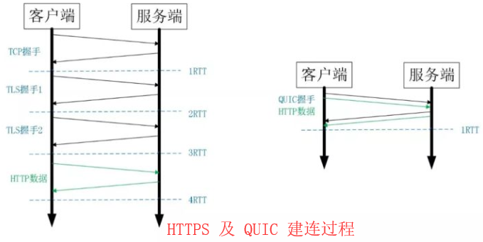
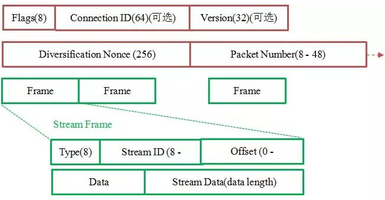

# HTTP/1.x缺陷

- 连接无法复用

- HTTP/1.0 每次都需要重新建立连接，增加延迟

- HTTP/1.1 虽然加入keep-alive可以复用一部分连接，但域名分片等情况下仍然需要建立多个connection，耗费资源，给服务器带来性能压力

- HOLB(Head-Of-Line-Blocking)：导致带宽无法被充分利用，以及后续健康请求被阻塞 [HOLB](http://stackoverflow.com/questions/25221954/spdy-head-of-line-blocking)是指一系列包（package）因为第一个包被阻塞；当页面中需要请求很多资源的时候，HOLB（队头阻塞）会导致在达到最大请求数量时，剩余的资源需要等待其他资源请求完成后才能发起请求。

- HTTP 1.0：下个请求必须在前一个请求返回后才能发出，`request-response`对按序发生。显然，如果某个请求长时间没有返回，那么接下来的请求就全部阻塞了。

- HTTP 1.1：尝试使用 pipeling 来解决，即浏览器可以一次性发出多个请求（同个域名，同一条 TCP 链接）。但 pipeling 要求返回是按序的，那么前一个请求如果很耗时（比如处理大图片），那么后面的请求即使服务器已经处理完，仍会等待前面的请求处理完才开始按序返回。所以，pipeling 只部分解决了 HOLB。

- **协议开销大**： HTTP1.x 在使用时，header 里携带的内容过大，在一定程度上增加了传输的成本，并且每次请求 header 基本不怎么变化，尤其在移动端增加用户流量。

- **安全因素**：HTTP1.x 在传输数据时，所有传输的内容都是明文，客户端和服务器端都无法验证对方的身份，这在一定程度上无法保证数据的安全性

# SPDY协议

# HTTP/2新特性

1. 二进制传输

HTTP/2将请求和响应数据分割为更小的帧，并且它们采用二进制编码。

重要概念：

流： 流是连接中的一个虚拟信道，可以承载双向的消息；每个流都有一个唯一的整数标识符；

消息：是指逻辑上的HTTP消息，比如请求、响应等，由一个或多个帧组成。

帧： HTTP/2 通信的最小单位，每个帧包含帧首部，至少也会标识出当前帧所属的流，承载着特定类型的数据，如HTTP首部、负荷，等等

HTTP/2 中，同域名下所有通信都在耽搁连接上完成，该连接可以承载任意数量的双向数据流。每个数据流都以消息的形式发送，而消息又由一个或多个帧组成。多个帧之间可以乱序发送，根据帧首部的流标识可以重新组装。

2. 多路复用

3. Header 压缩

在HTTP/1 中，我们使用文本的形式传输header，在header携带cookie的情况下，可能每次都需要重复传输几百到几千的字节。

HTTP/2 采用了首部压缩策略

HTTP/2 在 client和server use header table 来跟踪和存储之前发送的k-v pair

对于same data 不再通过每次 req和 resp 发送

header table 在 HTTP/2 连接存续阶段 始终存在，由client和server共同更新

every new k-v pair will change the old value or 追加到当前表的末尾

1. Server push

Server 可以通过 push的方式将client 需要的内容 预先push过去 “cache push”

prefetch 在browser兼容的情况下可以使用

server可以主动把js和css文件推送给client 而不需要client解析html时再发送请求

服务端可以主动推送，客户端也有权利选择是否接收。如果服务端推送的资源已经被浏览器缓存过，浏览器可以通过发送 RST_STREAM 帧来拒收。主动推送也遵守同源策略，换句话说，服务器不能随便将第三方资源推送给客户端，而必须是经过双方确认才行。

# HTTP/3新特性

HTTP/3 简介

HTTP/2 使用了多路复用，一般来说同一域名下只需要使用一个 TCP 连接。但当这个连接中出现了丢包的情况，那就会导致 HTTP/2 的表现情况反倒不如 HTTP/1 了。

因为在出现丢包的情况下，整个 TCP 都要开始等待重传，也就导致了后面的所有数据都被阻塞了。但是对于 HTTP/1.1 来说，可以开启多个 TCP 连接，出现这种情况反到只会影响其中一个连接，剩余的 TCP 连接还可以正常传输数据

google 基于UDP的QUIC协议

QUIC新功能

0-RTT

通过类时TCP快速打开的技术，缓存当前会话的上下文，在下次恢复会话的时候，只需要将之前的缓存传递给服务端验证就可以进行传输了

0RTT建连可以说是QUIC相比HTTP2最大的性能优势

传输层0RTT就能建立连接

加密层0RTT就能建立加密连接

多路复用

QUIC原生实现了多路复用，并且在传输的单个数据流可以保证有序交付且不会影响其他的数据流

同一条QUIC连接上可以创建多个stream 且stream间互不依赖(因为基于UDP)

不存在TCP队头阻塞

通过ID去识别连接 在移动端的表现好

加密认证的报文

TCP协议头部没有经过加密和认证 在传输过程中容易被中间网络设备篡改、注入和窃听

QUIC除了个别报文 PUBLIC_RESET 和 CHLO 都是经过认证的 Body都是经过加密的

向前纠错(FEC) Forward Error Correction

每个数据包除了它本身 还包括了部分其他数据包的数据

少量的丢包可以通过其他包的冗余数据直接组装

# 总结

- HTTP/1.x 有连接无法复用、队头阻塞、协议开销大和安全因素等多个缺陷

- HTTP/2 通过多路复用、二进制流、Header 压缩等等技术，极大地提高了性能，但是还是存在着问题的

- QUIC 基于 UDP 实现，是 HTTP/3 中的底层支撑协议，该协议基于 UDP，又取了 TCP 中的精华，实现了即快又可靠的协议
